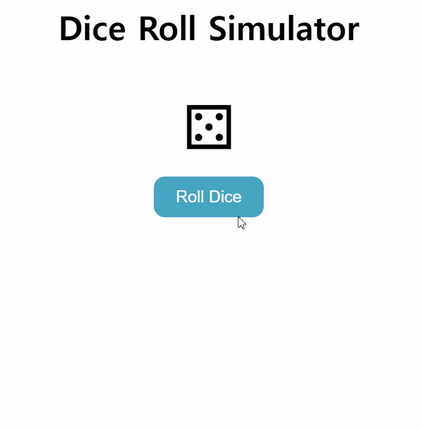

# Dice-Roll-Simulator



## 기능 
주사위를 돌린 결과를 화면에 표시 

<br>

## 사이트   
https://www.compart.com/en/unicode/U+2684  
아이콘 유니코드로 가져올 수 있는 사이트 (주사위 아이콘 가져와서 사용)   
 

<br>

## 학습
### 1. CSS : animation-fill-mode 
CSS 애니메이션이 실행 전과 후에 대상에 스타일을 적용하는 방법을 지정

|속성값|의미|
|---|---|
|none|애니메이션이 끝난 후 상태를 설정하지 않습니다.|
|forwards|애니메이션이 끝난 후 그 지점에 그대로 있습니다.|
|backwards|애니메이션이 끝난 후 시작점으로 돌아옵니다.|
|both|애니메이션이의 앞 뒤 결과를 조합하여 설정합니다.|
|inherit|애니메이션의 상태를 상위 요소한테 상속받습니다.|

<br>

### 2. CSS : @keyframes 
애니메이션 중간중간의 특정 지점들을 거칠 수 있는 키프레임들을 설정함으로써 CSS 애니메이션 과정의 중간 절차를 제어   
```
.roll-animation {
  animation-name: roll;
}

@keyframes roll {
  0% {
    transform: translateX(0%);
  }
  100% {
transform: translateX(100%);
  }
}
```
<br>  

**roll**  
: keyframe 목록을 식별하는 이름입니다. 이 이름은 CSS 구문에서 생성된 식별자와 일치  

**from**  
시작 offset인 0% 입니다.

**to**  
마지막 offset인 100% 입니다.

**(percentage)**  
전체 애니메이션 시간 중 명시된 keyframe이 발생해야 하는 시점의 %입니다.   

<br>

### 3. JS : switch  
: 특정 변수를 **다양한 상황**에서 비교    
: switch문은 하나 이상의 case문으로 구성됩니다. 대개 default문도 있지만, 이는 필수는 아닙니다.  
```
switch(x) {
  case 'value1':  // if (x === 'value1')
    ...
    [break]

  case 'value2':  // if (x === 'value2')
    ...
    [break]

  default:
    ...
    [break]
}
```
- 변수 x의 값과 첫 번째 case문의 값 'value1'를 일치 비교한 후, 두 번째 case문의 값 'value2'와 비교합니다. 이런 과정은 계속 이어집니다.  
- case문에서 변수 x의 값과 일치하는 값을 찾으면 해당 case 문의 아래의 코드가 실행됩니다. 이때, break문을 만나거나 switch 문이 끝나면 코드의 실행은 멈춥니다.
- 값과 일치하는 case문이 없다면, default문 아래의 코드가 실행됩니다(default 문이 있는 경우).

<br>

### 3. 백틱( ` )  
: ES6에서는 템플릿 리터럴이라는 새로운 문자열 표기법을 도입했다.

: 템플릿 리터럴은 이중 따옴표나 작은따옴표 대신 백틱을( ` )사용해서 표현하는데 ' 작은따옴표와 혼동할 수가 있으나 백 틱은 일반적으로 키보드 tab키 위에 있는 표시를말한다.

: **백틱(backtick) 사용 이유**

- "", '', + 연산자를 사용하지 않고 **간단하게 문자열을 삽입**할 수 있다.
- (\n)등 줄 바꿈이나 공백 표현을 위해서 백 슬래시로 시작하는 Escape Sequence를 사용하지 않아도 된다.
- 문자열 내부에 포함식을 포함할 수 있다.
- 멀티라인 사용이 가능하다.

: 템플릿 리터럴은 플레이스 홀더를 이용한 **${expression}** 으로 표현식을 넣어준다.

```
listItem.innerHTML = `Roll ${i + 1}: <span>${getDiceFace(historyList[i])}</span>`;
```

<br>

## 학습 출처 
**CSS**   
https://developer.mozilla.org/ko/docs  
https://webstoryboy.co.kr/1659  

**JS**  
https://ko.javascript.info/switch  
https://moo-you.tistory.com/501  

**키워드**   
- animation-fill-mode    
- keyframes  
- switch  
- 백틱

